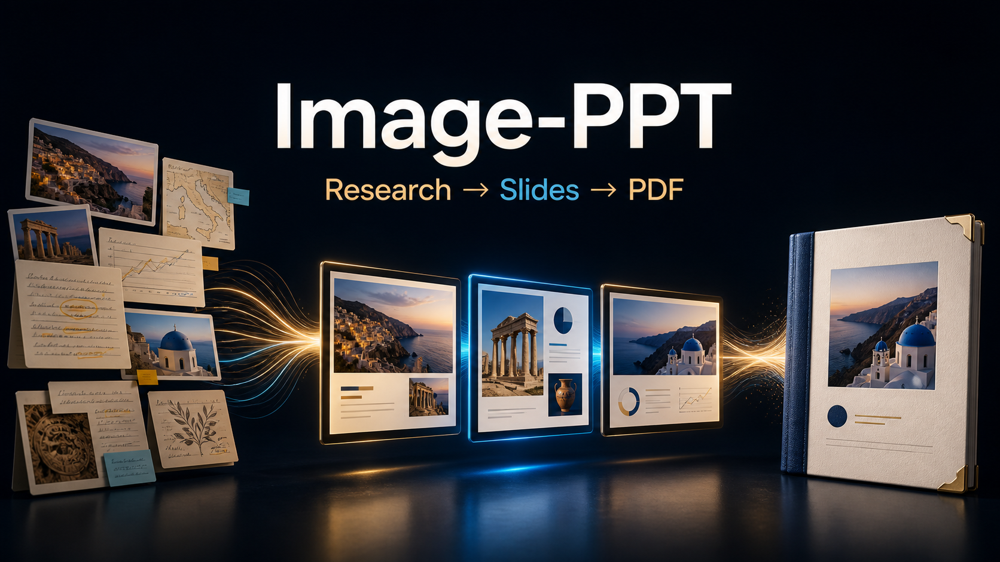

<p align="center">
  
</p>

<h1 align="center">Image-PPT</h1>

<p align="center">用 <code>gpt-image-2</code> 把有来源的内容制作成风格一致的 16:9 整页图片，并在验证后合成为 PDF。</p>

<p align="center">简体中文 · <a href="README.md">English</a></p>

Image-PPT 适用于最终可以不可编辑的图片型演示。它把资料研究、事实溯源、逐页文案、图片提示词、生成状态、视觉检查和 PDF 合成放进同一套可追踪流程。

## 核心价值

- 先建立研究问题、来源分层和事实账本，再写大纲；
- 锁定逐页文案，并用封面、密集事实页、叙事页三种原型控制风格；
- 通过 JSONL manifest 支持断点续做和失败页单独修复；
- 逐页检查文字、事实、构图和风格，再用 contact sheet 检查整套一致性；
- 只有所有页面通过验证后，才合成并核对 PDF 页数。

## 运行环境边界

Agent Skills 兼容只说明 Skill 结构可以被加载。完整生图还要求当前会话确实能够调用 `gpt-image-2`。

| 环境 | 模式 | 可交付内容 |
|---|---|---|
| 带内置图片生成的 Codex | 完整模式，首选 | 研究、逐页生图、QA、PDF；无需 API key |
| 提供可调用 `gpt-image-2` 工具的其他 Agent | 条件完整模式 | 按宿主工具规则执行完整流程 |
| 用户明确授权的 OpenAI API 路线 | 条件完整模式 | 凭据保留在本地，API 可能产生费用 |
| 没有兼容图片生成能力 | planning-only | 研究、来源账本、大纲、文案、风格契约、manifest、提示词和交接包 |

planning-only 模式会明确说明图片与 `final_deck.pdf` 尚未生成。

## 安装

Codex：

```bash
npx skills add vliuyt/image-ppt --agent codex --global --yes --copy
```

其他兼容 Agent Skills 的环境：

```bash
npx skills add vliuyt/image-ppt --global --all --yes --copy
```

安装完成后重启当前会话，再明确调用：

```text
$image-ppt 请围绕【主题】制作一套有来源、不可编辑、16:9 整页图片形式的演示，并合成为有序 PDF。
```

安装 Skill 不会自动给宿主增加图片模型。若没有可调用的 `gpt-image-2` 路线，Skill 会停在 planning-only 交接包。

## 分工边界

- 可编辑 PowerPoint：`ppt-master`
- HTML 网页演示：`guizang-ppt-skill`
- 单张或少量独立图片：`imagegen`
- 不可编辑逐页图片 + PDF：Image-PPT

入口契约见 [SKILL.md](SKILL.md)，环境能力说明见 [runtime-support.md](references/runtime-support.md)。

## 验证与维护

```bash
python scripts/check_public_release.py
python -m unittest discover -s tests -v
```

GitHub Actions 会在提交、Pull Request、手动触发和每月计划任务中运行检查。依赖由 Dependabot 每月检查。问题与改进建议可提交到 [Issues](https://github.com/vliuyt/image-ppt/issues)。

官方参考：[Codex 图片生成](https://learn.chatgpt.com/docs/image-generation)、[GPT Image 2 模型](https://developers.openai.com/api/docs/models/gpt-image-2)。本项目为独立开源项目，与 OpenAI 无隶属或背书关系。图片中的文字和事实仍需人工复核；使用 API 时费用与限额以用户自己的 OpenAI 账户为准。

## License

[MIT](LICENSE)
